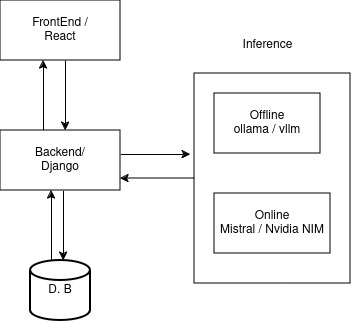

# Gaganyatri Project

[Discord Server](https://discord.gg/h8ygUwvw)

- Tech Stack
  - Frontend
    - React + Vite + Typescript
    - Hostend on GitHub Pages
  - Backend
    - Django + Python
    - Hosted on HuggingFace
  - AI inference
    - La Platforme - Mistral

## Contributing

Contributions are welcome! If you'd like to contribute to the project, please follow these steps:

1. Fork the repository.
2. Create a new branch: `git checkout -b feature/your-feature`
3. Make your changes and commit them: `git commit -m 'Add some feature'`
4. Push to the branch: `git push origin feature/your-feature`
5. Submit a pull request.

## License

This project is licensed under the MIT License - see the [LICENSE](LICENSE) file for details.

